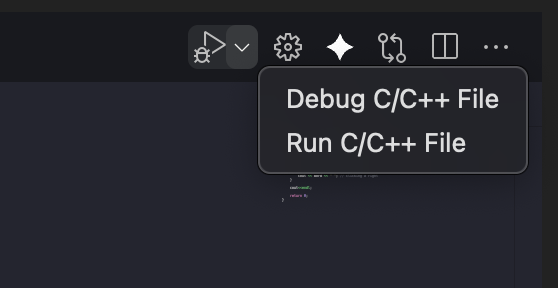
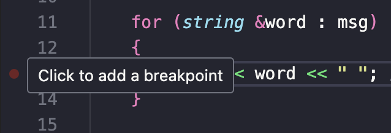
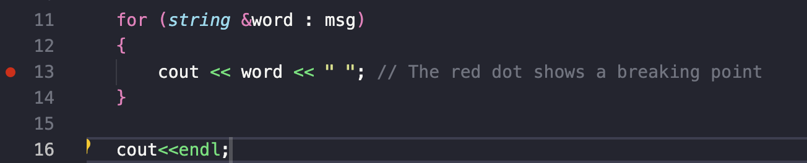
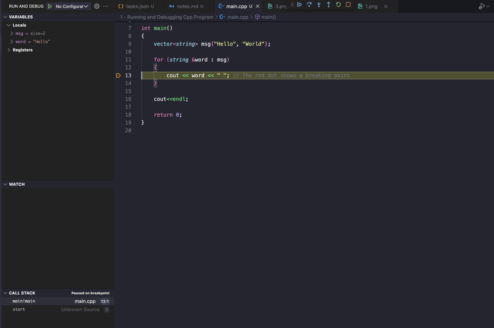
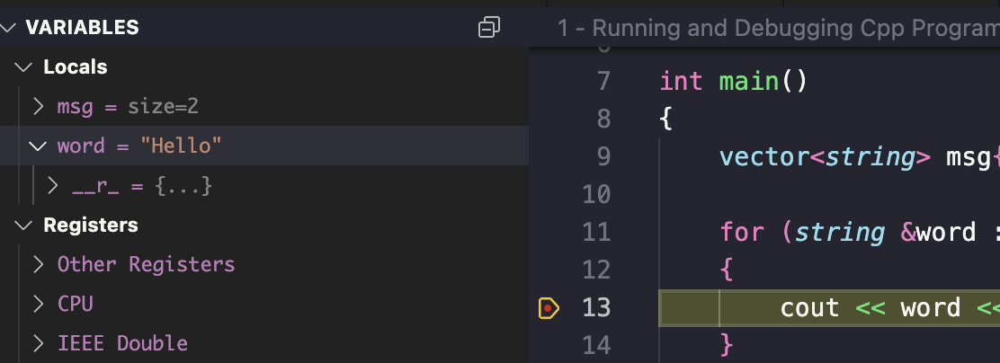
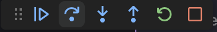
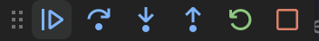
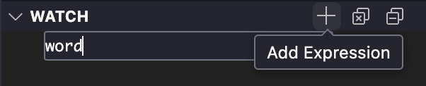

# 1 - Running and Debugging C++ Programs
Using VSCode + clang/gcc

## Installing & Configuring the compiler/debugger
- For MacOS (with Clang):
    [Using VSCode with Clang on MacOS](https://code.visualstudio.com/docs/cpp/config-clang-mac)
    
    **Note**: *Sometimes vscode complies your source code as C instead of C++.* 
    In that case, change `/usr/bin/clang` to `/usr/bin/clang++` in the configuration file to ensure the C++ Standard Library is linked correctly.
- For Windows (Using MinGW-w64):
    [Using VSCode with g++ on Windows](https://code.visualstudio.com/docs/cpp/config-mingw)

## Compile & Run Code
1. Press the play button in the top right corner of the editor. 
        

## Debugging
1. Set a breakpoint by clicking on the empty space on the left of a line 
    You should see a red dot on the left.
    

2. From the drop-down next to the play button, select `Debug C/C++ File`. 

3. Highlight shows where the code is executing at the moment. 

4. Check the variables on the left side 

5. On the debugging control panel, use the `Step` button (or Press F10) to step through the code line by line. 
    
    Use the `Continue` button (or Press F5) to jump to the next breakpoint. 
    

6. Clicking the `+` icon under `watch` and enter an expression to watch 
    and you should see how the value of the expression changes as we step through the code. 